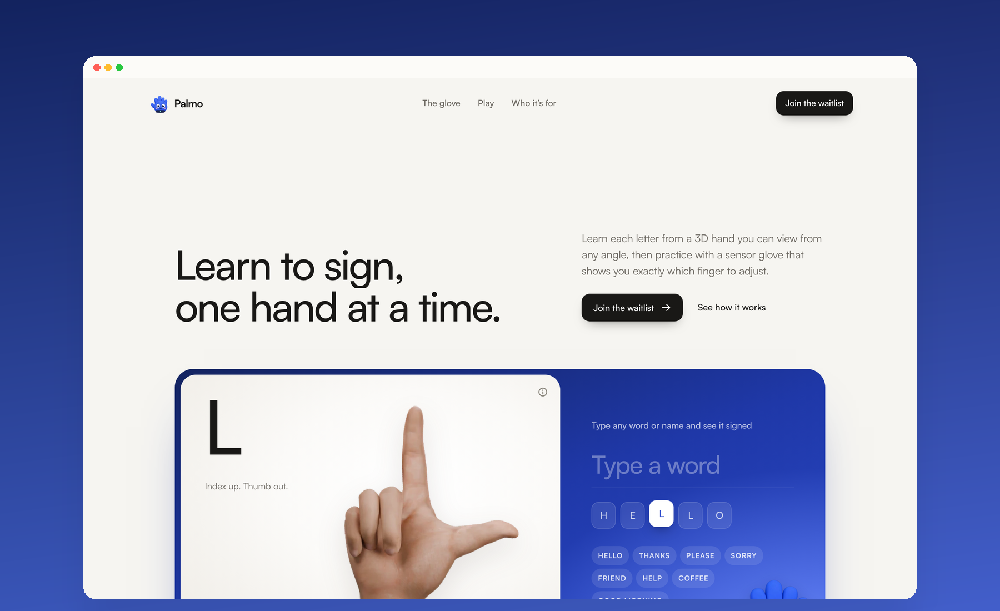
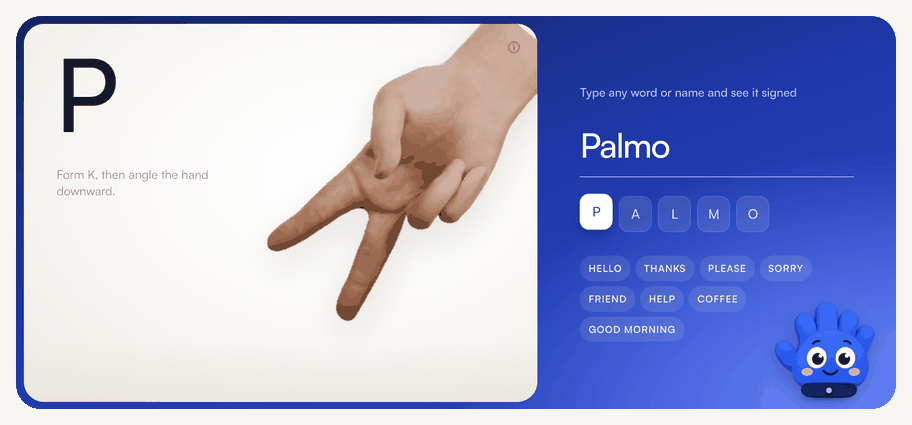
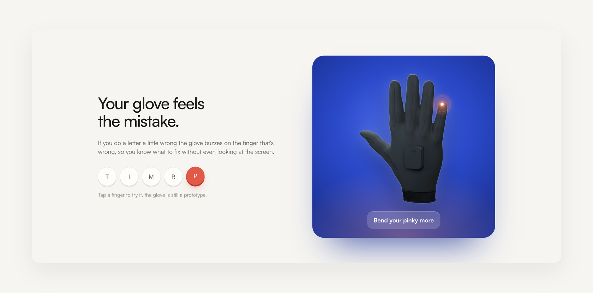
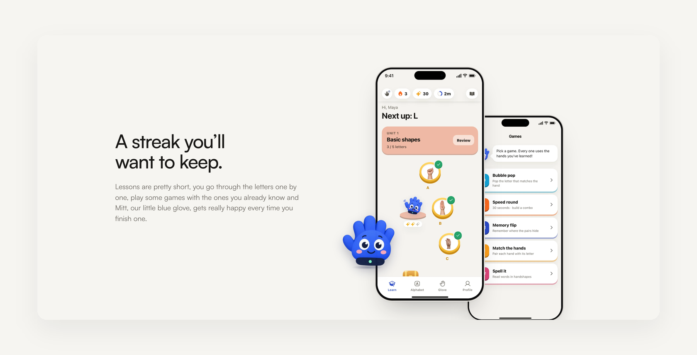
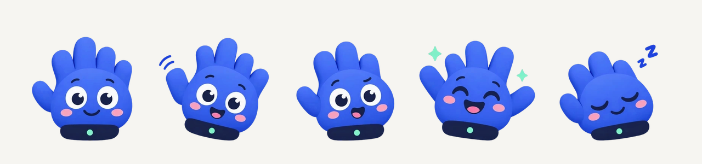
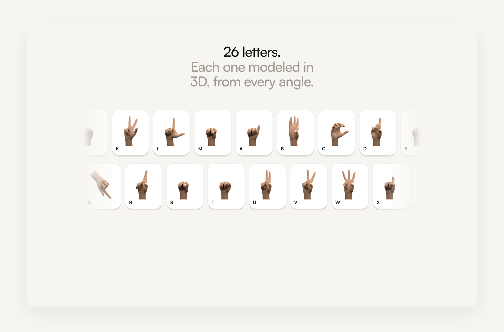
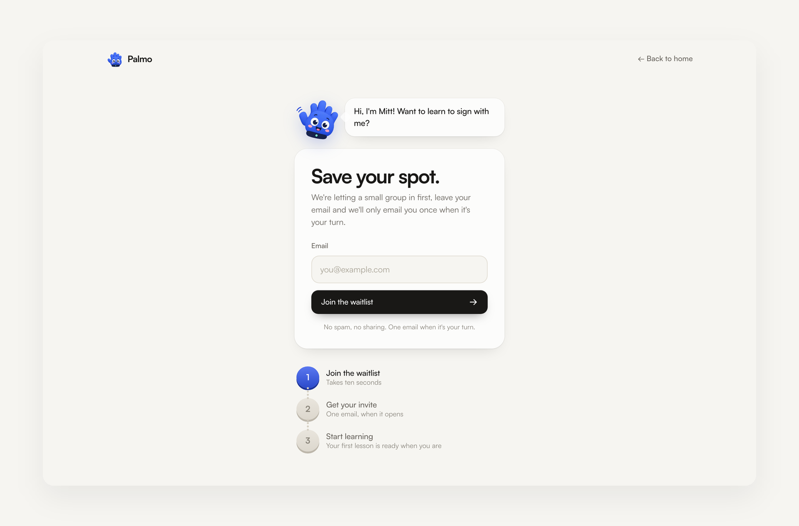
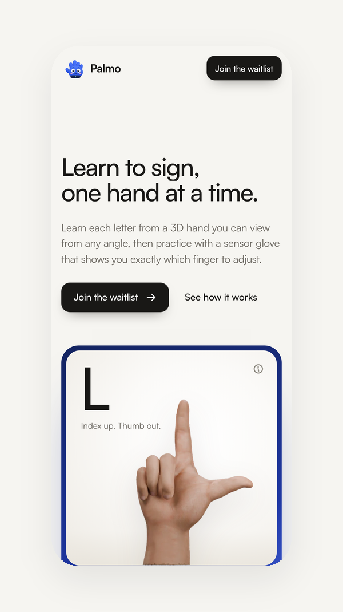

<p align="center">
  
</p>

<h1 align="center">Palmo "Website"</h1>

<p align="center">
  <strong>Learn to sign, one hand at a time.</strong><br />
  The ASL alphabet, taught with 3D hands and a sensor glove that shows you exactly which finger to adjust.
</p>

<p align="center">
  
  
  
  
  
</p>

<br />

<p align="center">
  
</p>

---

## What is Palmo?

Most people who want to learn sign language start with videos. You copy the hand on screen, it looks close enough, and nobody tells you that one finger was wrong. Small mistakes turn into habits, and a lot of people quit before the alphabet sticks.

**Palmo fixes the feedback problem.** Every letter is shown on a 3D hand you can view from any angle. When you practice, a sensor glove reads all five fingers, and if one drifts, the app names it and the glove buzzes that exact finger.

It's built for the people around Deaf family and friends: the parents, siblings, cousins, friends and coworkers who want to actually talk with them. About 9 in 10 Deaf children are born to hearing parents, and many of those families never learn to sign fluently.

This repository is the **marketing website and waitlist** for Palmo.

<br />

## Try it: type a word, watch it signed

The hero of the site is a live demo. Type any word or name and a 3D hand fingerspells it letter by letter, with the handshape tip for each letter. Mitt, our mascot, watches, talks while you type and cheers when the word is done.

<p align="center">
  
</p>

<br />

## How it works

| | |
|---|---|
| **1. See it** | Every letter is a 3D hand you can turn and replay, with a written cue for the shape. |
| **2. Try it** | Put on the glove and make the letter. Five flex sensors read each finger in real time. |
| **3. Fix it** | If a finger is off, the app names it and the glove buzzes that finger, no sound needed. |
| **4. Keep it** | Short lessons, a path of letters, streaks and five small games keep you coming back. |

<br />

## The glove

A soft knit glove with a flex sensor on every finger and a small pod on the back of the hand. On the site you can tap any finger to see where the buzz lands.

<p align="center">
  
</p>

> The glove is a working prototype and still in development. The renders on the site are concept renders.

<br />

## Learning that feels like play

Lessons take a few minutes. You follow a path of letters, play small games with the ones you already know, and get a streak for showing up.

<p align="center">
  
</p>

<br />

## Meet Mitt

Mitt is Palmo's mascot, a small blue glove who hosts every lesson. On the website Mitt is fully animated: the body moves at 60 fps (bob, sway, wave, squash-and-stretch jump), and hand-drawn frames are only used for the face (blinks, talking, happy eyes, sleeping).

<p align="center">
  
</p>

<br />

## All 26 letters

<p align="center">
  
</p>

<br />

## Waitlist

A calm, one-screen sign-up page hosted by Mitt. In this version the form stores the email only in the visitor's browser; connect it to your email tool before launch (see below).

<p align="center">
  
</p>

<p align="center">
  
</p>

<br />

## Built Deaf-aware

- **Nothing depends on sound.** Every cue is written or shown on the hand.
- **Feedback you can feel.** Corrections arrive as a buzz on the finger that needs to move.
- **Reduced motion respected.** Every animation has a calm fallback for `prefers-reduced-motion`.

<br />

## Tech

- **React 19 + TypeScript + Vite**: fast, static, no backend required
- **Framer Motion**: scroll reveals, springy entrances and the mascot's motion
- **Satoshi** typeface, self-hosted
- **Phosphor** icons
- Hand renders produced in **Blender**; images served as optimized WebP

### Run locally

```bash
npm install
npm run dev
```

Open http://127.0.0.1:5175. In development a small **Design** panel appears in the bottom-left corner to compare the calm and playful versions and try other fonts. It is never shown in production builds.

### Build

```bash
npm run build
```

The static site is written to `dist/`.

### Deploy

The site is fully static. It deploys as-is to Vercel, Netlify or Cloudflare Pages:

- **Build command:** `npm run build`
- **Output directory:** `dist`
- Client-side routes (`/join`, `/privacy`) are handled by `vercel.json` and `public/_redirects`.

### Connecting the waitlist

The form lives in `src/Join.tsx`. Replace the `localStorage` call in `submit()` with a request to your email provider (for example Loops, ConvertKit, Resend or a Formspree endpoint) before going live.

### Project structure

```
src/
  Home.tsx      landing page sections
  Join.tsx      waitlist page
  Privacy.tsx   privacy page
  mascot.tsx    Mitt, the animated mascot
  playful.tsx   marquee, entrances, wave
  letters.ts    hand render sizes and letter cues
  design.tsx    dev-only design panel (versions and fonts)
  ui.tsx        buttons, links, phone frame, spelling hand
  tokens.css    colors, type, spacing
  site.css      all styles
public/img/
  hands/        3D hand renders, one per letter
  thumbs/       small hand thumbnails
  anim/         Mitt's face frames
  mascot/       Mitt stills
  screens/      app screenshots
```

<br />

## Status

Palmo is pre-launch. The app prototype works, the glove is in prototype testing, and we're opening to a small group first through the waitlist.

---

<p align="center">
  <sub>© 2026 Palmo. All rights reserved.</sub>
</p>
